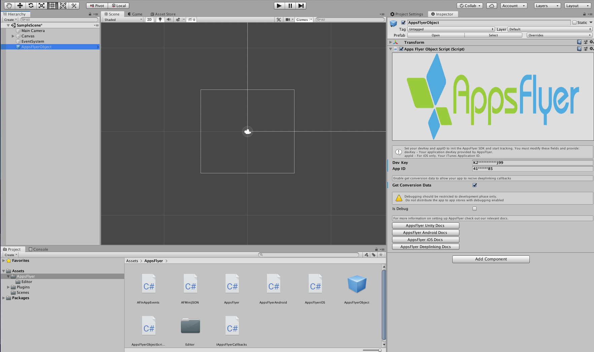

# Basic Integration

You can initialize the plugin by using the AppsFlyerObject prefab or manually.

- [Initialization using the prefab](#using-prefab)
- [Manual integration](#manual-integration)
- [Init with the deeplinking callbacks](#init-sdk-deeplink)
- [Collect IDFA with ATTrackingManager](#collect)
- [Sending SKAN postbacks to AppsFlyer](#skan)
- [Mac OS initialization beta](#macos)

### <a id="using-prefab"> Using the AppsFlyerObject.prefab

1. Go to Assets > AppsFlyer and drag AppsFlyerObject.prefab to your scene.

<br/>
2. Update the following fields:

| Setting  | Description   |
| -------- | ------------- |
| **Dev Key**   |  AppsFlyer's [Dev Key](https://support.appsflyer.com/hc/en-us/articles/207032126-Android-SDK-integration-for-developers#integration-31-retrieving-your-dev-key), which is accessible from the AppsFlyer dashboard. |
| **App ID**      | Your iTunes Application ID. (If your app is not for iOS the leave field empty)  |
| **Get Conversion Data**    | Set this to true if your app is using AppsFlyer for deep linking.  |
| **Is Debug**    | Set this to true to view the debug logs. (for development only!)  |

3. Update the code in Assets > AppsFlyer > AppsFlyerObjectScript.cs with other available [API](/docs/API.md).

### <a id="manual-integration"> Manual integration

Create a game object and add the following init code:

```c#
using AppsFlyerSDK;

public class AppsFlyerObjectScript : MonoBehaviour
{
  void Start()
  {
    AppsFlyer.initSDK("devkey", "appID");
    AppsFlyer.startSDK();
  }
}
```

> **Note:** 
> - Make sure not to call destroy on the game object. 
> - Use [`DontDestroyOnLoad`](https://docs.unity3d.com/ScriptReference/Object.DontDestroyOnLoad.html) to keep the object when loading a new scene.

---

### <a id="init-sdk-deeplink"> AD_ID permission for Android

In v6.8.0 of the AppsFlyer SDK, we added the normal permission com.google.android.gms.permission.AD_ID to the SDK's AndroidManifest, to allow the SDK to collect the Android Advertising ID on apps targeting API 33. If your app is targeting children, you need to revoke this permission to comply with Google's Data policy. You can read more about it [here](https://dev.appsflyer.com/hc/docs/install-android-sdk#the-ad_id-permission).


---
# <a id="collect"> Collect IDFA with ATTrackingManager

1. Add the `AppTrackingTransparency` framework to your xcode project. 
2. In the `Info.plist`:
    1. Add an entry to the list: Press +  next to `Information Property List`.
    2. Scroll down and select `Privacy - Tracking Usage Description`.
    3. Add as the value the wording you want to present to the user when asking for permission to collect the IDFA.
3. Call the `waitForATTUserAuthorizationWithTimeoutInterval` api before `startSDK()`
    
    ```c#
    #if UNITY_IOS && !UNITY_EDITOR
    AppsFlyer.waitForATTUserAuthorizationWithTimeoutInterval(60);
    #endif
    ```
        
4. Reques the tracking authorization where you wish to display the prompt: <br/>
    You can use the following [package](https://github.com/Unity-Technologies/com.unity.ads.ios-support) or any other package that allows you to request the tracking authorization. 
    ```c#

    using Unity.Advertisement.IosSupport;

    /*  ... */
  
    if (ATTrackingStatusBinding.GetAuthorizationTrackingStatus() 
         == ATTrackingStatusBinding.AuthorizationTrackingStatus.NOT_DETERMINED)
        {
            ATTrackingStatusBinding.RequestAuthorizationTracking();
        }
     /*  ... */
  
  
---
# <a id="skan"> Sending SKAN postback to Appsflyer
  To register the AppsFlyer endpoint, you need to add the `NSAdvertisingAttributionReportEndpoint` key to your info.plist and set the value to `https://appsflyer-skadnetwork.com/`. 
More info on how to update the info.plist can be found [here](https://github.com/AppsFlyerSDK/appsflyer-unity-plugin/blob/master/docs/Troubleshooting.md#updating-the-infoplist). 

--- 


# <a id="listeners"> Request Listeners
    
1. Attach the 'AppsFlyer.cs' script to the game object with the AppsFlyer init code. (AppsFlyerObject, ect)
2. Add the following code **before** startSDK()

Sessions response example:

```c#
    void Start()
    {
        AppsFlyer.OnRequestResponse += AppsFlyerOnRequestResponse;
        
        AppsFlyer.initSDK(devKey, appID, this);
        AppsFlyer.startSDK();
    }

    void AppsFlyerOnRequestResponse(object sender, EventArgs e)
    {
        var args = e as AppsFlyerRequestEventArgs;
        AppsFlyer.AFLog("AppsFlyerOnRequestResponse", " status code " + args.statusCode);
    }
```

In-App response example:

```c#
    void Start()
    {
        AppsFlyer.OnInAppResponse += (sender, args) =>
        {
            var af_args = args as AppsFlyerRequestEventArgs;
            AppsFlyer.AFLog("AppsFlyerOnRequestResponse", " status code " + af_args.statusCode);
        };
        
        AppsFlyer.initSDK(devKey, appID, this);
        AppsFlyer.startSDK();
    }


```

| statusCode      | errorDescription | 
| ----------- | ----------- | 
| 200      | null       | 
| 10   | "Event timeout. Check 'minTimeBetweenSessions' param"        | 
| 11   | "Skipping event because 'isStopTracking' enabled"        | 
| 40   | Network error: Error description comes from Android        | 
| 41   | "No dev key"        | 
| 50   | "Status code failure" + actual response code from the server        | 

---


---
# <a id="macos"> MacOS initialization
1. Use the prefab `AppsFlyerObject`
2. Add your MacOS app id
3. Build for the platform `PC, Mac & Linux Standelone` and choose `MacOS` as the target platform.
